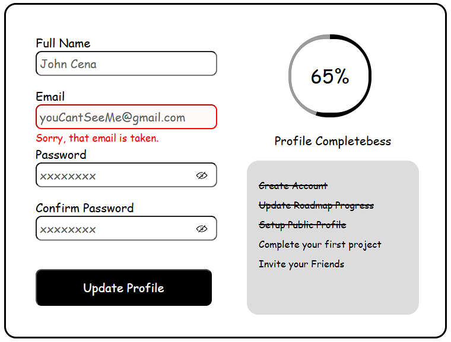

# Accessible Form UI

## HTML and CSS Form

## Description

- This project was built with html and css
- The motivation behind this project was to create a form that is accessible to everyone
- This will help people that can't see
- While creating this project, I learned about conic gradient. This helped build the progress bar.

## Usage
- Click on the link to head to the Project Repository https://github.com/0mar77/accessible-form-ui
- Clone the repository
- Launch in local environment

## Project URL
https://roadmap.sh/projects/accessible-form-ui

